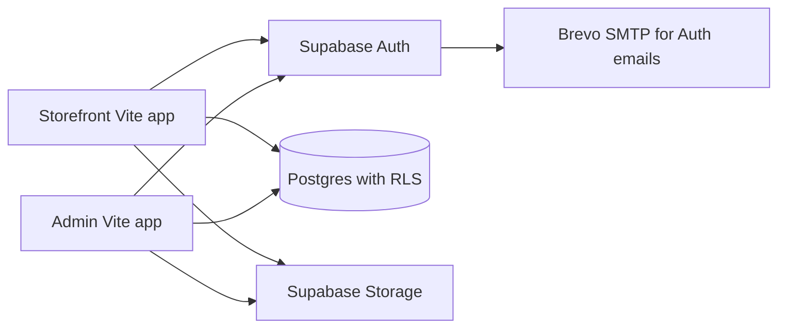

# SaWrap backend: implementation and release guide

**Updated 5 October 2026.** The source apps now use Supabase. The `combined/` directory is the original static ZIP build and still contains browser-only data and demo authentication. Do not deploy `combined/` as the live store.

## Current status

The Supabase project is `cwhplubnatrlcutnulhj` (`https://cwhplubnatrlcutnulhj.supabase.co`). On 5 October 2026 the SQL in `supabase/migrations/` was applied through its SQL Editor. A live verification query found **17 application tables, all 17 with RLS enabled, five Storage buckets, and five order functions**; the later payment-reference function was applied successfully as well. Anonymous API tests were denied direct access to orders and staff records. Anonymous sign-in and manual account linking are enabled. The original menu was subsequently restored: **11 products and three add-ons** are in Supabase and visible on the deployed storefront.

Brevo custom SMTP is configured in Supabase Auth with a dedicated key. The SMTP key is stored only in the provider dashboards, not in this repository. Its sender is the verified `sebastianortelo984@gmail.com` address. Brevo flags this Gmail sender as a freemail domain without authenticated DKIM/DMARC; switch to a SaWrap-owned authenticated domain before public launch and test delivery. The dedicated key is set to expire on 5 October 2027, or after 90 days of inactivity under Brevo's current policy.

The source builds pass and the focused changed-file ESLint checks pass. Both Vercel production builds are ready and their pages were checked through the signed-in account:

- Storefront: `https://sawrap-storefront.vercel.app` (`sebastianortelo984-3827/sawrap-storefront`).
- Admin: `https://sawrap-admin.vercel.app` (`sebastianortelo984-3827/sawrap-admin`).

Vercel Authentication currently protects both deployments. They were deployed from the local `codex/sawrap-backend` source with the Vercel CLI, **without a Git connection**. The repository belongs to the separate `ruicchi` GitHub account, which the current user cannot access; its owner must grant Vercel access to this one repository before automatic deployments can be enabled. Do not connect or deploy the old `main` branch. The owner confirmed that the original product list is the actual menu, so its names, categories, descriptions, prices, stock counts, and add-ons were copied to Supabase without overwriting any existing rows. The stock counts came from the ZIP's browser seed and still need a physical count; the ZIP had no product photos. On 2026-10-06 the owner supplied eleven flavor photos, which were uploaded through the admin portal to the Supabase `catalog-images` bucket and verified on all eleven live storefront cards. The source PNGs and two unused reference images are preserved in `sawrap-project/catalog-images/`; see [the image manifest](CATALOG_IMAGE_MANIFEST.md). No payment account details have been entered. `sebastianortelo984@gmail.com` accepted the Auth invitation, set a password, and was granted an active `owner` role for the verified Auth user ID `1e8ef8cb-9c33-4ded-af50-91d78c258147`. The account holder signed in to the deployed admin app; its menu, orders, and staff navigation loaded, with no orders yet.

Supabase Auth's Site URL is `https://sawrap-storefront.vercel.app`. Its exact redirect allow list contains that origin and `https://sawrap-admin.vercel.app`. The invitation email was delivered and the account was confirmed; password reset and guest account upgrade still need real inbox tests.

## Architecture



Both apps use the same Supabase project and publishable key. The publishable key can appear in browser code; RLS and Auth decide access. No service-role or secret key belongs in a `VITE_` variable. Postgres stores product and add-on prices as integer centavos. The database computes order totals and vouchers; clients send IDs and quantities. Orders, line prices, and E-Wallet reference/proof are durable. Staff can verify an E-Wallet reference, then accept an order; acceptance atomically checks and deducts stock. A reference alone is never proof of payment.

### Main data paths

| User action | Backend behavior |
| --- | --- |
| Browse menu | Public RLS reads active products, add-ons, banners and store settings. |
| Guest checkout | Supabase creates an anonymous Auth identity; order history belongs to that identity in the same browser. |
| Registered checkout | Email/password Auth and profile; the same order function handles both customer types. |
| Cash order | `place_order` records the order and payment; staff accepts and deducts stock. |
| E-Wallet order | `place_order` locks the final amount first, including voucher. Customer pays and submits a reference via `submit_payment_reference`, with optional proof image. Staff verifies manually before accepting. |
| Order progress | `transition_order` allows `Pending → Preparing → Ready → Completed` or `Pending → Cancelled`. It logs events and creates customer notifications. |
| Courier | Customer supplies their booking reference after acceptance with `save_courier_reference`. SaWrap does not charge a courier fee. |
| Messages | Own conversation is visible to the customer; active staff can read and reply. |

The app refreshes data on focus and at intervals. Realtime publication is enabled for orders, messages and notifications, but the current React code still uses refetching; live subscription UX is future work.

## Files and local run

- Database migrations: `supabase/migrations/20261005090000_sawrap_core.sql`, `20261005091000_sawrap_order_functions.sql`, `20261005092000_sawrap_public_catalog_access.sql`, `20261005093000_sawrap_payment_capture.sql`, `20261005100000_sawrap_original_menu.sql`.
- Storefront Vercel root: `sawrap-project/sawrap-ecommerce`.
- Admin Vercel root: `sawrap-project/sawrap-admin-portal`.
- Each app has `.env.example`. The real ignored `.env.local` files on this workstation contain the project URL and publishable key; Vercel CLI also added a local OIDC token. Never commit either `.env.local` file or either `.vercel/` directory.

Run each app separately in its own terminal:

```powershell
cd sawrap-project/sawrap-ecommerce
npm ci
npm run dev
```

```powershell
cd sawrap-project/sawrap-admin-portal
npm ci
npm run dev
```

Both apps need `VITE_SUPABASE_URL` and `VITE_SUPABASE_PUBLISHABLE_KEY` in `.env.local` for local work, and the same two environment variables in their respective Vercel projects for deployments. The storefront's read-only backend check is `node scripts/verify-backend.mjs` after `.env.local` exists.

Until Git is connected, redeploy the existing Vercel projects manually from this linked workstation after checking out the intended branch:

```powershell
cd sawrap-project/sawrap-ecommerce
npx --yes vercel@latest deploy --prod --yes --scope sebastianortelo984-3827
```

```powershell
cd sawrap-project/sawrap-admin-portal
npx --yes vercel@latest deploy --prod --yes --scope sebastianortelo984-3827
```

## Remaining setup before customers use it

1. **Connect Git safely:** have the `ruicchi` repository owner install or authorize the Vercel GitHub App for only `ruicchi/sawr-app`. Connect both existing Vercel projects to that repository, retain their respective source root directories, and set their Production Branch to `codex/sawrap-backend` before allowing an automatic production build. The repository's `main` branch still contains the original browser-only source. Later assign the public domain to the storefront project and `admin.` to the admin project. Both may share one GitHub repository and one Supabase project.
2. **Test Auth email links:** Site URL and exact redirects are configured. Test signup, guest upgrades, and password resets on the deployed storefront. The owner invitation and admin sign-in were verified. Vercel Authentication must allow the intended test recipient to open each link. Keep the admin project protected while staff workflows are tested.
3. **Verify the restored menu and finish business data:** check all 11 product prices and physically confirm stock in the admin portal. The eleven owner-supplied product photos are now live. Add the store address/phone and official E-Wallet account/QR. Do not remove Vercel Authentication until the catalog and checkout are ready for customers.
4. **Test payment and access flows:** on distinct customer and staff accounts, place Cash and E-Wallet orders (including a voucher and add-on), verify E-Wallet reference/proof, accept and complete, test insufficient stock and duplicate submit, and confirm customers cannot see each other's orders or messages. Confirm a cancelled paid order has a manual refund procedure.
5. **Authenticate the mail domain:** add and verify a SaWrap-owned sender in Brevo with required DNS records, then change Supabase's sender address. Test signup, invite and reset delivery. The current verified Gmail sender is provisional.

The SQL was executed in Supabase's SQL Editor. Its migration-history table was not updated by that action. Before later using Supabase CLI `db push`, reconcile migration history against the live schema; reapplying the initial `create table` statements would fail.

## Practical limits

- A guest's anonymous Auth session lives in that browser until they link an email. Clearing browser data can lose access to their guest history. The account-linking path needs a live email test.
- Cash is recorded as a payment method, not as automatically received money. Staff must handle collection on pickup.
- E-Wallet verification is manual. There is no payment provider webhook or automatic refund.
- No checkout fee, tax, delivery charge, product-specific add-on rule, multi-branch inventory, consent-record table, or retention scheduler has been implemented. These require business rules before launch.
- The admin portal currently has no staff-management screen. The owner role can be added through reviewed SQL after a verified Auth account exists.
- The static `combined/` build and the original audit are preserved for comparison; they are not part of the deployable backend apps.
