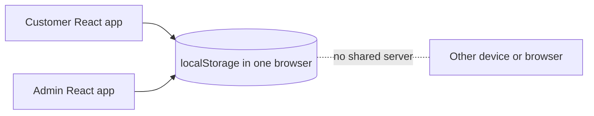
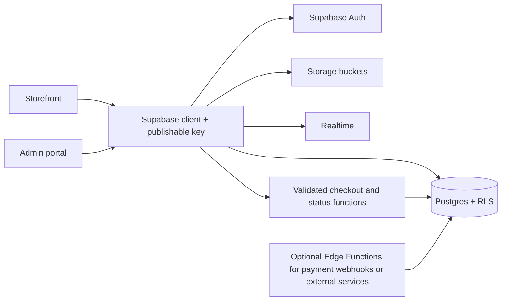

# SaWrap code audit and Supabase backend guide

**Status:** this is the audit of the original ZIP as received on 5 October 2026. Its references to browser storage and demo authentication describe the supplied baseline, which has since been replaced in the two source apps. See [the implementation and release guide](BACKEND_IMPLEMENTATION.md) for current behavior and live project status. The `combined` directory still contains the original static build.

## 1. What the supplied code does today

SaWrap has two React/Vite apps: `sawrap-ecommerce` for customers and `sawrap-admin-portal` for staff. The `combined` directory serves both from one origin (`/` and `/admin`). The apps exchange data through the browser's `localStorage`, not through a server. Changes are visible across tabs on the same origin, but not across customers' devices or browsers. The admin and storefront each keep their own React state and use a mix of storage events and polling.

The main data bridge is [`sawrap-project/sawrap-ecommerce/src/utils/storage.js`](../sawrap-project/sawrap-ecommerce/src/utils/storage.js). The admin keeps most behavior in [`Dashboard.jsx`](../sawrap-project/sawrap-admin-portal/src/pages/Dashboard.jsx). The two supplied PDFs are useful inventories of fields and screens, but the checked-in source is the authority for the findings below.



| Current key / state | Used for | Supabase destination |
| --- | --- | --- |
| `sawrap_products` | Menu, price, availability, stock, soft delete | `products` |
| `sawrap_addons` | Optional add-ons and prices | `addons` |
| `sawrap_banners` | Homepage promo image | `banners` |
| `sawrap_vouchers` | Admin voucher records; checkout has only a code input | `vouchers`, `voucher_redemptions` |
| `sawrap_store_info`, `sawrap_admin_qr` | Branch details and e-wallet QR image | `store_settings`, Storage |
| `sawrap_user` | One browser-local identity and plaintext password | Supabase Auth, `profiles`, `consent_records` |
| `sawrap_admin_credentials`, `sawrap_owner_token` | Browser-local staff login | Supabase Auth, `staff_members` |
| `sawrap_orders` | Orders and embedded line items | `orders`, `order_items`, `order_item_addons`, `order_status_events` |
| `sawrap_messages` | Phone-keyed conversations and embedded messages | `conversations`, `messages` |
| `sawrap_notifications` | Order and chat notifications | `notifications` |
| React `cartItems`, `favorites` | Unsaved cart and favorites | Keep cart in client initially; `favorites` table if persistence is wanted |

The PDFs call this "10 localStorage keys" in one heading, but their own list and the code include more. `sawrap_has_seen_splash` is also present; it is only a UI preference and needs no backend table.

## 2. Audit findings, in priority order

### Critical: authentication and customer isolation

1. **Admin access is a client-side check.** [`Login.jsx`](../sawrap-project/sawrap-admin-portal/src/pages/Login.jsx) compares a username and password with a hardcoded fallback or `localStorage`, then writes a fixed string to `sessionStorage`. [`App.jsx`](../sawrap-project/sawrap-admin-portal/src/App.jsx) accepts any nonempty `sawrap_owner_token`. Anyone who controls their browser can set that value or edit the stored credentials. The admin screen is therefore not an access boundary.
2. **Customer login does not verify the password.** [`Profile.jsx`](../sawrap-project/sawrap-ecommerce/src/pages/Profile.jsx) accepts any password if the email matches the one saved user; for a different email it creates a new identity. Passwords are stored in plaintext. A new Supabase implementation must use Auth for sign-up, login, session handling, and password changes. Do not create a `password` or `password_hash` column in `profiles` or `staff_members`; Supabase Auth owns that data.
3. **Order history exposes all orders in the same browser.** [`OrderHistory.jsx`](../sawrap-project/sawrap-ecommerce/src/pages/OrderHistory.jsx) reads the entire `sawrap_orders` array and can update a courier reference for any item in it. Orders, messages, receipts, and notifications need authenticated ownership checks using a stable user ID, never a phone number alone.

### High: order integrity and money

4. **A newly placed order can be lost.** The admin loads `sawrap_orders` once into state, then writes that state back whenever it changes. Its storage listener and polling cover messages, not orders. If a customer places an order after the admin page opens, the admin can stay stale; a later admin status edit can overwrite the newer browser list. A shared database with transactional updates fixes the underlying model.
5. **Checkout reports success even if storage fails.** [`Checkout.jsx`](../sawrap-project/sawrap-ecommerce/src/pages/Checkout.jsx) ignores the Boolean result of `safeSetItem`, clears the cart, and shows success. The backend checkout must return a confirmed order ID before the UI clears the cart.
6. **Prices and receipts can disagree.** [`ProductDetail.jsx`](../sawrap-project/sawrap-ecommerce/src/pages/ProductDetail.jsx) displays each add-on's stored price. [`CartContext.jsx`](../sawrap-project/sawrap-ecommerce/src/context/CartContext.jsx) instead charges a fixed ₱15 per add-on, although a seeded add-on costs ₱10. Checkout stores only the base item price and add-on names; [`ReceiptModal.jsx`](../sawrap-project/sawrap-ecommerce/src/components/ReceiptModal.jsx) displays base item subtotals beside a total that can include add-ons. The server must compute prices from product/add-on IDs and save price snapshots for every line.
7. **Stock is adjusted after staff acceptance without a database transaction.** [`Dashboard.jsx`](../sawrap-project/sawrap-admin-portal/src/pages/Dashboard.jsx) matches ordered items to products by name, clamps stock to zero, and changes the order status separately. Renaming a product can prevent deduction; concurrent acceptances can oversell. Use immutable product IDs, row locks, sufficient-stock checks, and one atomic status/stock update.
8. **IDs and status transitions are trusted to the browser.** Checkout creates an `SW-` code with `Math.random()`. Admin handlers update status by replacing objects, with no server-side validation of allowed transitions. Generate a UUID primary key and unique display code in the database, and reject invalid transitions.

### Medium: unfinished flows and data handling

9. **Voucher and payment flows are incomplete.** The voucher code input has no validation or redemption call; `setDiscountAmount` is never called. An e-wallet reference is only text supplied by the customer, not payment verification. `eWalletProof` exists as state but is not uploaded or saved. Store the reference/proof as a **pending verification** record; a staff action or payment-provider callback should confirm it.
10. **Checkout's additional request is discarded.** `orderMessage` is collected in the UI but absent from the saved order. Add an `order_note` field if the store needs it.
11. **Consent is checked but not recorded.** Sign-up requires the terms/privacy boxes, yet the saved user has no consent version or timestamp. If those acknowledgments matter as records, save document versions and accepted times server-side. This is a product/legal decision, not a reason to store checkbox state from an unauthenticated client as proof.
12. **Browser storage and base64 images limit reliability.** Product, banner, avatar, and QR images can be stored as large data URLs. `safeSetItem` catches quota errors, but many callers ignore the result. Use Supabase Storage for files and save paths/metadata in Postgres.
13. **Some screens still use demo data.** The admin seeds a sample order; catalog and vouchers also have seed records. Verify the real menu, prices, stock, and staff identities before importing. The PDFs are partially stale: they say vouchers are absent from the storefront, but checkout now has a code input; they say admin credentials are no longer hardcoded, but the code still contains a hardcoded fallback.

This is a source audit. It does not establish that the current build passes linting, runtime flows, cross-device tests, or a Supabase security review.

## 3. Recommended Supabase shape

Use one Supabase project for the first branch. The public Vite apps use the project URL and a **publishable** key; those identify the project, not the user. Supabase Auth issues user sessions. PostgreSQL stores authoritative records. Row Level Security (RLS), grants, and narrowly scoped database functions decide which rows each user may read or change. Supabase Storage holds images and payment proof. Realtime subscriptions can refresh orders, chat, and notifications. Keep secret/service-role keys in server-side code or Supabase secrets only, never in `VITE_` variables or browser bundles. [Supabase API keys](https://supabase.com/docs/guides/api/api-keys), [RLS](https://supabase.com/docs/guides/database/postgres/row-level-security).



### Proposed tables

Use UUID keys, `created_at`/`updated_at` timestamps, foreign keys, check constraints, and integer **centavos** (`price_centavos`, `total_centavos`) for PHP money. Keep the visible `SW-...` order code as a separate unique column. The proposed names are a design draft, not a deployed schema.

| Table | Important columns / purpose |
| --- | --- |
| `profiles` | `user_id` references `auth.users`, name, normalized phone, address, avatar path. No password. |
| `consent_records` | `user_id`, document type/version, accepted timestamp; insert via a controlled signup/consent flow. |
| `staff_members` | `user_id`, `role` (`owner`/`staff`), `active`; populated only by an owner/admin process. |
| `products` | UUID, name, category, description, `price_centavos`, stock, `is_available`, image path, `deleted_at`. |
| `addons` | UUID, name, `price_centavos`, availability, `deleted_at`. A join table can later restrict add-ons by product. |
| `banners` | UUID, image path, `sort_order`, active flag, `deleted_at`. |
| `vouchers` | Unique code, type (`fixed`/`percent`), value, minimum spend, dates, active flag, redemption limits, `deleted_at`. |
| `voucher_redemptions` | Voucher, order, customer, amount applied; unique rules prevent duplicate use. |
| `store_settings` | One row for the current branch: name, phone, address, hours, QR image path. Add `branch_id` to operational tables if multibranch is approved. |
| `orders` | UUID, unique display code, `customer_id`, contact/address snapshots, fulfillment, note, status, subtotal/discount/total, created timestamp, cancellation reason. |
| `order_items` | Order/product IDs, name/category snapshots, quantity, base unit price, line total. |
| `order_item_addons` | Order-item/add-on IDs, name and unit price snapshots. |
| `payments` | Order ID, method, e-wallet reference, private proof path, state (`unverified`/`verified`/`rejected`), verifier/time. |
| `order_status_events` | Order, from/to status, actor, timestamp, reason; append-only audit trail. |
| `conversations`, `messages` | Conversation owned by `customer_id`; messages have sender user ID/role, body, timestamps, read markers; `deleted_at` for staff trash. |
| `notifications` | Customer ID, type, order ID, title/body, created/read timestamps. |
| `favorites` | Unique `(customer_id, product_id)` pair. |

Keep the cart in React state for the first backend release. Add `carts`/`cart_items` only if users need a saved cart across devices. Stock-change history (`stock_movements`) is advisable if staff will audit inventory, but it can follow the first secure order flow.

### Identity and guest checkout

- **Registered customers:** Supabase Auth email/password, verified email according to the product's sign-up policy, plus one `profiles` row keyed by `auth.users.id`. Use Auth methods for login and email/password changes. Profile edits update `profiles`; sensitive account changes use an Auth reauthentication flow rather than comparing a browser copy of a password. [User data](https://supabase.com/docs/guides/auth/managing-user-data), [updateUser](https://supabase.com/docs/reference/javascript/auth-updateuser).
- **Staff:** separate Auth users with rows in `staff_members`. The admin portal checks the session for navigation, but RLS/functions check the active staff row for every privileged operation. A hidden link or UI guard is not authorization.
- **Guests:** for an MVP that preserves guest checkout and private order history on one device, use Supabase anonymous sign-ins, so every guest has an Auth `user_id`. An anonymous account can be lost if the browser session is cleared; choose verified email/phone or an order lookup flow if cross-device recovery is required. Anonymous users use the `authenticated` database role, so policies must explicitly distinguish them when necessary. [Anonymous sign-ins](https://supabase.com/docs/guides/auth/auth-anonymous).
- Phone numbers remain contact data, not authorization IDs. Normalize them consistently (for example E.164) and do not use them alone to grant access to orders or messages.

### Access rules to implement before exposing data

| Resource | Customer/guest | Active staff | Public visitor |
| --- | --- | --- | --- |
| Active products, add-ons, banners, public store settings | Read | Read and manage | Read |
| Own profile, favorites, consent | Read/write own permitted fields | Limited support access only if justified | None |
| Orders, items, payment records, receipts | Read own; place order through validated function; limited own courier reference update | Read and perform permitted workflow actions | None |
| Conversations/messages/notifications | Read/write own thread as allowed | Read/reply/manage | None |
| Staff membership and roles | None | Owner manages through controlled server action | None |
| Payment proof files | Own upload/read as policy allows | Read for verification | None |

Enable RLS on **every** exposed application table and verify grants as well as policies. A customer policy should compare `customer_id = auth.uid()`; an admin policy must check an active `staff_members` row. Do not let customers directly update `orders.status`, monetary columns, stock, staff roles, or payment verification. An example ownership shape is:

```sql
create policy "customers read own orders"
on public.orders for select to authenticated
using (customer_id = (select auth.uid()));
```

This example is illustrative; a complete migration also needs table creation, grants, other policies, and tests. For privileged functions, prefer the default invoker model where possible. Any `security definer` checkout/status function needs a fixed `search_path`, qualified table names, explicit caller and staff checks, narrow `EXECUTE` grants, and tests against malicious inputs. [Supabase database functions](https://supabase.com/docs/guides/database/functions).

### Exact flow: placing and fulfilling an order

1. The customer signs in or receives an anonymous Auth identity. The storefront fetches active products and add-ons from Postgres. The cart sends **IDs and quantities**, not trusted prices or a trusted total.
2. A `place_order` database function validates the caller, contact fields, product/add-on availability, quantities, voucher terms, and an idempotency key. It reads current prices and computes centavo totals, then inserts the order, item/add-on price snapshots, and a pending payment record in one transaction. Return the database order ID and display code. The UI clears the cart **only after success**.
3. For e-wallet payment, show the store QR from Storage. A customer reference or uploaded proof marks the payment **unverified**. Staff verifies it, or a future payment-provider webhook confirms it. A typed reference alone must not mark it paid.
4. Staff calls a controlled `transition_order` function. Only `Pending -> Preparing -> Ready -> Completed` or `Pending -> Cancelled` is allowed in the current workflow. On acceptance, the function locks relevant product rows, checks all stock, decrements by product ID, writes the status event, and creates the customer notification atomically. If stock is insufficient, acceptance fails without changing anything. Completed/Cancelled are final.
5. Customer order history queries only the caller's orders. The receipt uses immutable price snapshots and persisted subtotal/discount/total, so every displayed line reconciles to the grand total.

If the business wants to reserve stock at **placement** instead of acceptance, design a hold and expiry policy before changing this sequence. The current UI deducts at acceptance, so the sequence above preserves that choice while making it safe.

### Storage, chat, Realtime, and scheduled cleanup

- Suggested buckets: public `catalog-images`/`banners` (readable by anyone, staff writes); private `payment-proofs` (customer owns upload and read, staff verifies); avatars can be public or private based on the chosen privacy policy; a store QR may be public if customers must display it. Save file paths, MIME type, and size in Postgres. Validate upload type/size and generate safe object names. Public buckets permit public reads; private buckets need policies or signed URLs. [Storage buckets](https://supabase.com/docs/guides/storage/buckets/fundamentals), [Storage access control](https://supabase.com/docs/guides/storage/security/access-control).
- Replace 2-second `localStorage` polling with database queries and Realtime subscriptions for customer orders, messages, and notifications. RLS must still protect the underlying rows. Refetch after reconnect or page focus so missed events do not leave stale screens. [Realtime database changes](https://supabase.com/docs/guides/realtime/subscribing-to-database-changes).
- Keep quick FAQ answers as a deterministic UI feature or a controlled server function, using public store settings. Avoid saving an automated answer as if a staff member typed it unless its sender is marked `system`.
- Soft-delete catalog objects and conversations with `deleted_at`. If a 30-day trash purge is required, run it centrally with Supabase Cron after agreeing on retention rules. Do **not** delete orders/receipts on the same schedule. [Supabase Cron](https://supabase.com/docs/guides/cron).
- Use an Edge Function only when an external payment provider, webhook, or server-only secret is involved. Database functions are a better fit for atomic order and stock changes. [Edge Functions](https://supabase.com/docs/guides/functions).

## 4. Build plan and checks

### What the team will install and add to this repository

- Add `@supabase/supabase-js` to **both** Vite apps (`npm install @supabase/supabase-js` inside each app). Put a small `src/lib/supabaseClient.js` in each app, then move storage calls behind focused modules such as `catalogApi`, `ordersApi`, `messagesApi`, and `authApi`. This lets UI components keep their current layout while data loading becomes asynchronous. [JavaScript client installation](https://supabase.com/docs/reference/javascript/installing).
- Add the Supabase CLI as a development dependency at the repository root, initialize `supabase/`, and commit `config.toml`, migrations, and development seeds. Run the local stack with a Docker-compatible runtime for integration tests. No CLI or stack has been installed by this audit. [Supabase CLI](https://supabase.com/docs/guides/local-development/cli/getting-started), [local workflow](https://supabase.com/docs/guides/local-development/cli-workflows).
- Add an example environment file documenting only `VITE_SUPABASE_URL` and `VITE_SUPABASE_PUBLISHABLE_KEY` for each app. The real `.env.local` files stay untracked. A publishable key is expected in a browser; security comes from Auth, grants, and RLS. Server secrets stay in the Supabase project or server environment. [API keys](https://supabase.com/docs/guides/api/api-keys).
- Keep two separate frontend builds if desired. Both can connect to the same Supabase project from different origins after Auth redirect URLs and CORS needs are configured. The same-origin `localStorage` bridge is no longer needed once all shared data lives in Supabase.

1. **Confirm business rules:** one branch or multiple; whether guests need cross-device order recovery; manual vs provider-verified e-wallet payment; courier fee/booking owner; voucher fixed amount vs percentage and usage limits; product-specific add-ons; consent document versions and retention. Record these before schema freeze.
2. **Create a development Supabase project:** add local Supabase CLI migrations, seed only verified menu/settings, and define storage buckets. Put `VITE_SUPABASE_URL` and `VITE_SUPABASE_PUBLISHABLE_KEY` in each app's untracked `.env.local`; keep secret keys in Supabase secrets only. Do not reuse production data during development.
3. **Implement Auth and RLS first:** customer, anonymous guest, and staff sessions; profile creation; owner-managed staff assignments; no client-side password table. Test as public, customer A, customer B, anonymous guest, staff, and disabled staff.
4. **Replace catalog reads/writes:** create a shared repository/API layer for the two apps, preserve soft-delete/restore, and move images to Storage. Remove browser seed writes after verified database seeds exist.
5. **Implement validated checkout and admin transitions:** test add-on prices, stock under simultaneous acceptances, duplicate submits, voucher rules, invalid transitions, cancelled orders, and payment verification. Make the UI wait for confirmed success.
6. **Move history, chat, notifications, favorites, and settings:** scope all reads by RLS, add Realtime where it helps, and verify on two different devices/accounts.
7. **Migrate only reviewed data:** `localStorage` exists separately in each browser, so there is no central dataset to import. Export a specific browser's records only with the owner's authorization; separate demo seeds from real records; deduplicate products/orders; do not import plaintext passwords or pretend browser-only identities are verified Auth users. Invite/re-register real people instead.
8. **Release gate:** RLS and function tests pass; no secret key appears in the web bundles; a customer cannot read another customer's order/chat/proof; staff role removal blocks writes; receipt lines equal total; no order can be lost on concurrent actions; both apps work across separate devices; payment remains unverified until confirmed.

## 5. Decisions still needed

The schema draft intentionally leaves these choices open: branch model, guest recovery, payment verification method, courier fees and booking, voucher type/limits, add-on eligibility, consent wording/versioning, data retention, and whether staff roles need more than owner/staff. Once these are answered, the next implementation artifact should be a reviewed SQL migration with RLS/function tests and a thin React data-access layer. It should be tested in a development Supabase project before any production deployment.
